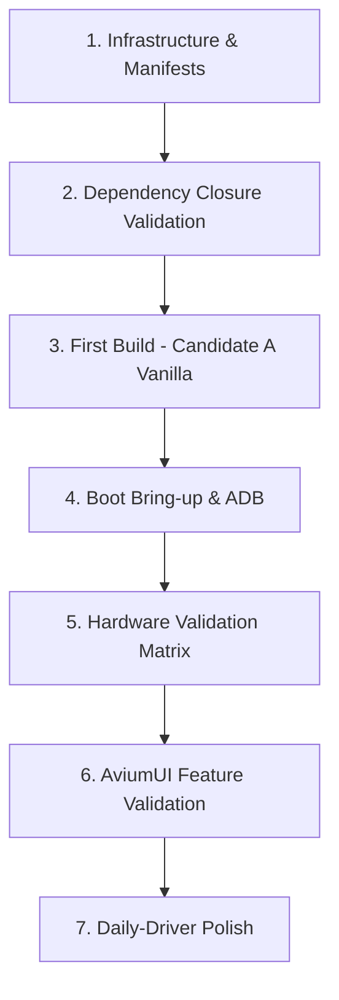

# AviumUI 16.2 (Android 16 QPR2) Bring-up Plan

This document outlines the systematic engineering roadmap for bringing up **AviumUI 16.2 (Android 16 QPR2)** on the **OnePlus 6 (`enchilada`)**, spanning from early infrastructure readiness to daily-driver verification.

---

## 🎯 First Build Target Definition (#1 Build)

* **Architecture Baseline**: **Candidate A** (Lineage 23.2 Device + Avium 16.2 Common + Avium 16.2 4.19 Kernel + Lineage 23.2 Hardware + TheMuppets 22.2 Vendor)
* **Build Flavor**: **Vanilla** (strictly clean AOSP/AviumUI stack without GMS / MicroG)
* **Release Type**: **Unofficial**
* **Build Cleanliness**: **No clean** (incremental ccache preservation on remote runner)
* **Device Customization Policy**: **No device-specific Avium overrides** (clean baseline without legacy `avium_enchilada.mk` variables)
* **Manifest Delivery**: `https://github.com/ColoMovo/aviumui-enchilada-manifests.git` (`enchilada.xml`)

---

## 🗺️ 7-Stage Bring-up Roadmap

### Stage 1: Infrastructure & Manifests
* [x] Set up the `aviumui-enchilada` Git orchestration skeleton.
* [x] Establish Candidate A source tracking and rationale ([SOURCES.md](SOURCES.md)).
* [x] Publish standalone manifest repository [`ColoMovo/aviumui-enchilada-manifests`](https://github.com/ColoMovo/aviumui-enchilada-manifests).
* [x] Submit upstream ROM-builders supported ROM whitelist PR (`#25789`).
* [x] Prepare build script draft (`scripts/rom-builders-build_rom.sh`).

### Stage 2: Dependency Closure Validation
* [x] Perform static build dependency closure analysis across `inherit-product`, `include`, `soong_namespaces`, and `PRODUCT_PACKAGES`.
* [x] Verify zero compile-blocking `requested_but_missing` vendor modules between Avium 16.2 common and TheMuppets 22.2 vendor.
* [x] Confirm roomservice dependency isolation (no duplicate tree checkouts).
* [x] Validate local simulated CI checks against ROM-builders rules.

### Stage 3: First Build (Candidate A Vanilla)
* [ ] Target: `lunch lineage_enchilada-bp4a-userdebug` && `m bacon`.
* [ ] Execute cloud compilation on ROM-builders / Crave.io runner.
* [ ] Debug and resolve any Soong / Blueprint / Make build-time warnings.
* [ ] Produce initial flashable output: `boot.img`, `dtbo.img`, `system.img`, `vendor.img`, `odm.img`, and full ROM zip.

### Stage 4: Boot Bring-up
* [ ] Flash image artifacts to test OnePlus 6 device via fastboot / recovery.
* [ ] Verify early 4.19.325 kernel UART / pstore / ramoops logs.
* [ ] Bring up Android init and verify Retrofit dynamic partitions mounting (`odm`, `product`, `system`, `system_ext`, `vendor`).
* [ ] Achieve functional ADB (`adbd`) over USB during early boot.
* [ ] Bring up SurfaceFlinger, DRM/KMS graphics drivers, and basic touch input.
* [ ] Reach Android boot animation and initialize `Zygote` / `SystemServer`.

### Stage 5: Hardware Validation
Systematic validation of hardware subsystems against the test matrix below.

### Stage 6: AviumUI Feature Validation
* [ ] Validate AviumUI Monet theme engine and GPU background blur on SDM845 Adreno 630.
* [ ] Verify AviumUI Lockscreen architecture, dynamic clock customization, and widgets.
* [ ] Test lightweight floating / freeform multi-window functionality.
* [ ] Verify AviumUI smart sidebar and quick access drawers.
* [ ] Test Avium Launcher desktop features, gesture navigation, and task switcher fluidity.

### Stage 7: Daily-Driver Polish
* [ ] Optimize battery drain during deep sleep (suspend / wakeup alarms / PMIC).
* [ ] Tune thermal management (`thermal-engine` / cpu frequency governor profiles).
* [ ] Enforce full SELinux policy (`enforcing` mode validation without policy denials).
* [ ] Clean up redundant debug flags and finalize release packaging.

---

## 🧪 Comprehensive Hardware & Subsystem Test Matrix

| Category | Component / Feature | Test Description | Target Status |
| :--- | :--- | :--- | :---: |
| **Core System** | **Boot & Recovery** | Cold boot, reboot, recovery boot, fastbootd | ⏳ Pending |
| **Core System** | **ADB & Fastboot** | USB debugging, root shell, file push/pull | ⏳ Pending |
| **Core System** | **Storage & Encryption** | FBE (File-Based Encryption) v2, userdata mount | ⏳ Pending |
| **Core System** | **SELinux** | Permissive boot -> clean Enforcing without denials | ⏳ Pending |
| **Core System** | **Suspend & Power** | Deep sleep, idle battery drain (<1%/h), charging | ⏳ Pending |
| **Display & Input** | **Display** | Refresh rate, brightness slider, night light | ⏳ Pending |
| **Display & Input** | **Touchscreen** | Multi-touch, edge gestures, tap-to-wake (DT2W) | ⏳ Pending |
| **Connectivity** | **Wi-Fi** | 2.4 GHz & 5 GHz bands, WPA3, hotspot tethering | ⏳ Pending |
| **Connectivity** | **Bluetooth** | A2DP audio streaming, BLE peripherals, pairing | ⏳ Pending |
| **Connectivity** | **NFC** | Card emulation, tag reading, contact sharing | ⏳ Pending |
| **Connectivity** | **GPS / Location** | GNSS fix (GPS, GLONASS, Galileo, BeiDou) | ⏳ Pending |
| **Telephony** | **RIL / Mobile Data** | SIM card detection, 4G LTE data throughput | ⏳ Pending |
| **Telephony** | **Calls & SMS** | CS/PS voice calls, SMS sending & reception | ⏳ Pending |
| **Telephony** | **IMS / VoLTE** | HD voice over LTE, VoWiFi registration | ⏳ Pending |
| **Audio** | **Audio Subsystem** | Speaker, earpiece, 3.5mm jack, dual mic routing | ⏳ Pending |
| **Media & Imaging** | **Camera** | Front & rear photo capture, 4K video, flashlight | ⏳ Pending |
| **Biometrics** | **Fingerprint** | Sensor enrollment, lockscreen match, sleep wake | ⏳ Pending |
| **Sensors** | **Sensor Array** | Accelerometer, Gyroscope, Proximity, Ambient Light, Compass, Hall sensor | ⏳ Pending |
| **AviumUI UI/UX** | **AviumUI Blur** | GPU blur rendering performance & stability | ⏳ Pending |
| **AviumUI UI/UX** | **Lockscreen** | Custom clock fonts, lockscreen widgets | ⏳ Pending |
| **AviumUI UI/UX** | **Lightweight Windows** | Freeform window resizing, drag & drop, PiP | ⏳ Pending |
| **AviumUI UI/UX** | **Sidebar** | Quick tool drawer activation, app shortcuts | ⏳ Pending |
| **AviumUI UI/UX** | **Launcher** | Gesture responsiveness, app search, app drawer | ⏳ Pending |

---

## 📊 Status Legend
* ⏳ **Pending**: Planned, awaiting build / device testing.
* 🟡 **In Progress**: Under active investigation or debugging.
* 🟢 **Verified**: Tested and functional without regressions.
* 🔴 **Blocked**: Known regression or upstream limitation identified.
